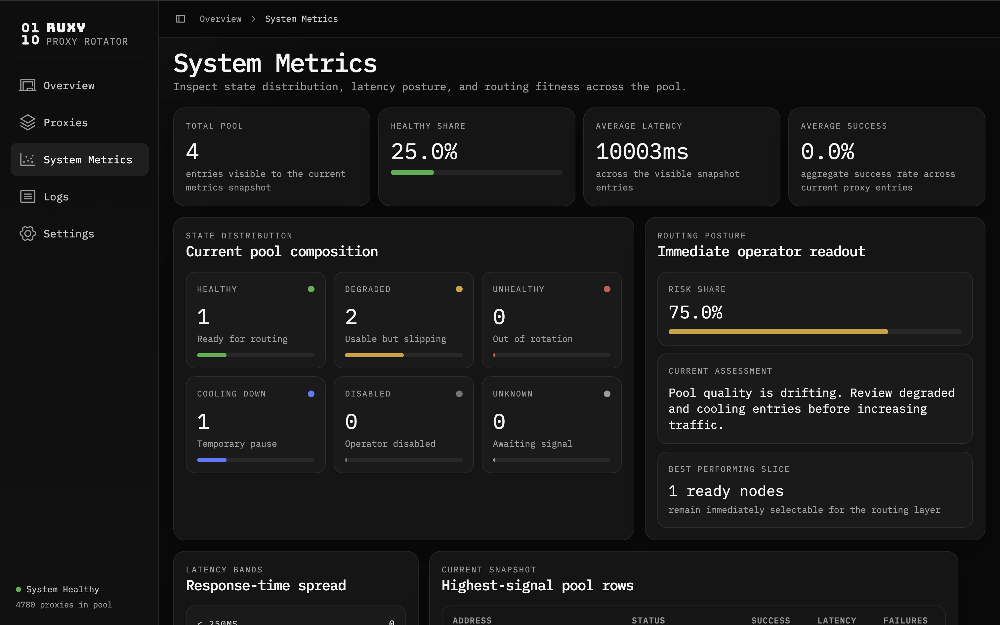

# Ruxy

Ruxy is a proxy rotation and proxy management platform built as a monorepo.

## Status

- Local stack is running through `docker compose`
- Dashboard, Core API, Proxy Server, Worker, and Postgres are wired together
- Proxy CRUD, health cycles, routing selection, events, and metrics are working end to end

## Stack

- `apps/dashboard`: Next.js admin dashboard
- `crates/core-api`: Rust control plane API
- `crates/proxy-server`: Rust data plane
- `crates/worker`: background health and aggregation jobs
- `crates/domain`, `crates/application`, `crates/infrastructure`, `crates/shared`: supporting workspace crates

## Running services

- Dashboard: `http://localhost:3000`
- Core API: `http://localhost:8001`
- Proxy Server: `http://localhost:8000`
- PostgreSQL: `localhost:5432`

## Current docs

- [docs/sprint-0.md](./docs/sprint-0.md): staged execution path
- [docs/health-state-machine.md](./docs/health-state-machine.md): MVP health transition rules
- [docs/api-contract-v1.md](./docs/api-contract-v1.md): first API contract draft
- [docs/schema-v1.md](./docs/schema-v1.md): first database schema draft

## Current dashboard

System Metrics view from the current dashboard:



## Current capabilities

- Create, list, and delete proxies from the dashboard
- Reject malformed hosts such as `host:port` in the `host` field
- Run worker-based health cycles and persist proxy state
- Select healthy proxies through the proxy server
- Record routing events and request-level telemetry
- View overview, logs, system metrics, and settings in the dashboard

## Local setup

Rust:

```bash
source "$HOME/.cargo/env"
cargo check
```

Frontend:

```bash
pnpm install
```

Full stack:

```bash
docker compose up --build
```

Useful checks:

```bash
curl http://localhost:8001/api/proxies
curl http://localhost:8001/api/health/summary
curl http://localhost:8000/health
```

## Roadmap

The next implementation targets are:

1. tighten request forwarding behavior in `proxy-server`
2. connect more dashboard surfaces to live telemetry
3. add stricter validation and operational polish
